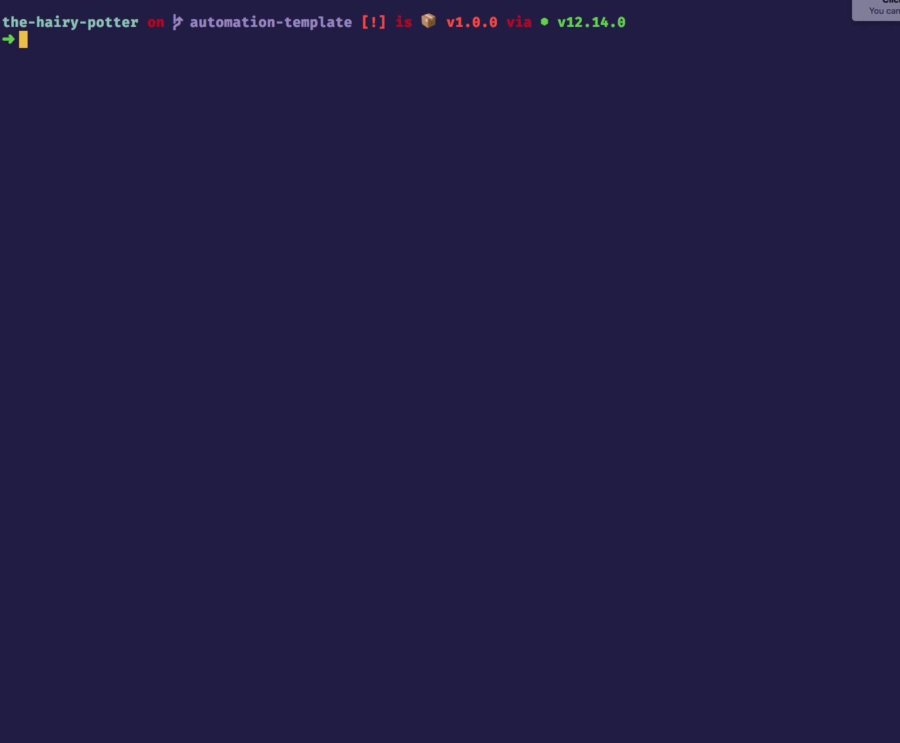
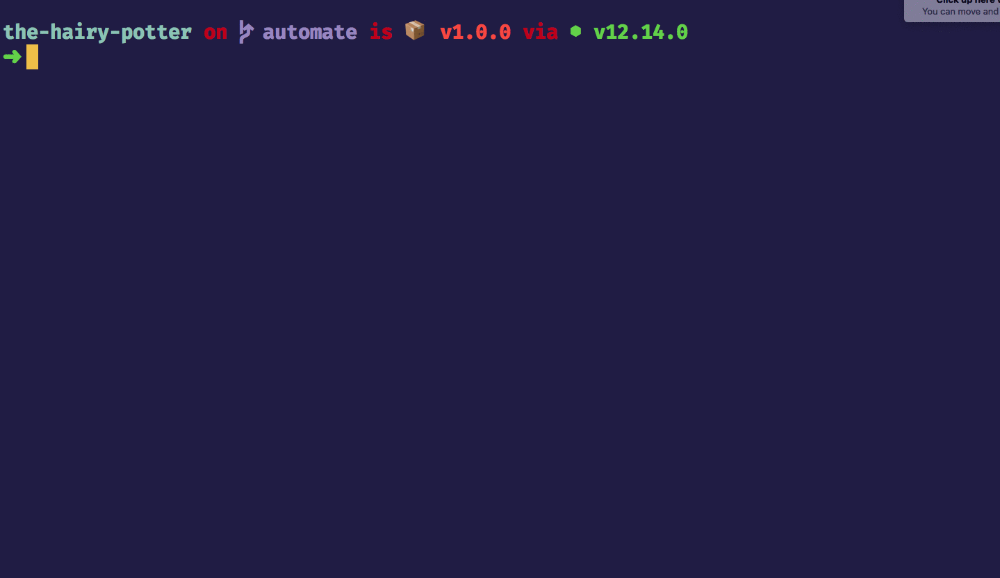

# Core JavaScript Review

## The Hairy Potter

In this exercise, your task to build a workflow for making, and firing pottery, and then determining if it should be sold at a craft show. Then you will display the pottery to be sold in the DOM.

## Setup

1. Once the project is cloned, run `npm install` in the project directory.
1. To test your code, use the `npm run test` command. You will see all of the tests for your code - which ones pass, and which ones fail. As soon as you make changes to your code, the tests will run automatically.
    
1. Once all of your tests pass, this will be the output.
    


## Making Pottery at the Wheel

1. Create a `scripts/PotteryWheel.js` module.
1. Define a module-level variable to create the primary key for each piece of pottery. It should have an initial value of 1.
1. Define and export a function named `makePottery`.
1. The `makePottery` function must accept the following values as input, in the following order.
    1. Shape of the piece of pottery (e.g. "Mug", "Platter")
    1. Weight of the piece (e.g. 1, 5)
    1. Height of the piece (e.g. 3, 7)
1. The `makePottery` function must return an object with the following properties on it.
    1. `shape`
    1. `weight`
    1. `height`
    1. `id` _(increment this value each time the function is invoked)_

## Firing the Pottery in the Kiln

1. Define a `scripts/Kiln.js` module.
1. Define and export a function named `firePottery` that is responsible for acting as a kiln.
1. The function must accept the following values as input, in the following order.
    1. An object representing a piece of pottery that was made at the wheel.
    1. A number specifying the firing temperature of the kiln.
1. The function must add a new property of `fired` with the value of `true` to the object. It should output the pottery object.
1. The function must add a new property of `cracked` to the object.
    1. If the temperature of the kiln is above 2200 degrees then `cracked` property must have a value of `true`.
    1. If the temperature of the kiln is at, or below,  2200 degrees then `cracked` property must have a value of `false`.

## Pricing Uncracked Pottery

1. Create a `scripts/PotteryCatalog.js` module.
1. Define a module-level variable with a value of an empty array. This array will store pottery that will be sold.
1. Define and export a function named `toSellOrNotToSell` that is responsible for determining if a piece of pottery should be sold.
1. The `toSellOrNotToSell` function must accept a pottery object as input.
1. If the weight of the piece of pottery is greater than, or equal to, 6 then the function must add a `price` property with a value of 40.
1. If the weight of the piece of pottery is less than 6 then the function must add a `price` property with a value of 20.
1. If the pottery is **not** cracked, add the object to the module-level array of items to be sold.
1. Define and export a function named `usePottery` returns a copy of the module-level array of items to be sold. Recall which array method creates a copy of the array.

## Display the Catalog

In this exercise, you are going to create HTML representations of the pottery you want to sell at the craft fair and display them on the DOM. Then you will track which ones you sell.

### Define DOM Target

1. Create an `<article>` element in the `index.html` file.
1. The article element must have a class of `potteryList`.

### Create Pottery HTML

1. Create a `scripts/PotteryList.js` module.
1. Define and export a `PotteryList` function.
1. The `PotteryList` function must get the items to be sold from the `PotteryCatalog.js` module.
1. The `PotteryList` function must convert each object in the array to an HTML representation string. Use the following template to generate the representations.
    ```html
    <section class="pottery" id="pottery--1">
        <h2 class="pottery__shape">Mug</h2>
        <div class="pottery__properties">
            Item weighs 3 grams and is 6 cm in height
        </div>
        <div class="pottery__price">
            Price is $20
        </div>
    </section>
    ```
1. Once all pottery objects have been converted to HTML representation strings, update the inner HTML of the `<article>` element with that string.

